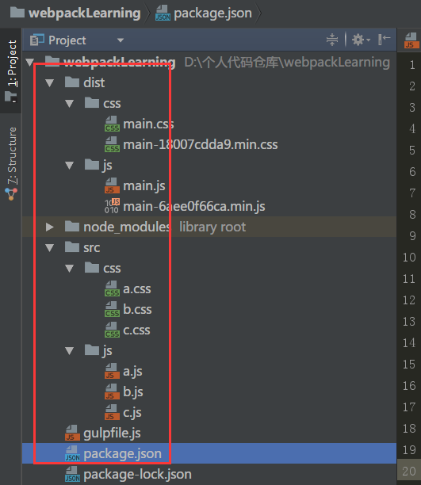
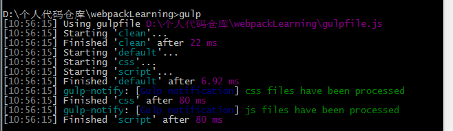

## gulp一键压缩js和css文件

## 这个项目提供什么功能？
- 合并项目中src目录下所有的js/css文件为一个单独文件
- 压缩（混淆js）对应的文件
- 重命名文件，提供原始版本，以及min版本
- 提供md5的文件后缀
- 提供文件处理后的提示

## 为什么有这个项目？

  项目中总是会引进很多的js和css文件，而且每次上线，都需要对js和css，重新压缩，为了调试还必须保留原文件，每次都去压缩网站手动压缩，效率低下，而且引入的文件越多，页面加载也越来越慢

## 项目必备的运行环境

  需要node，npm install node -g

  需要gulp，npm install gulp -g

## 安装

  下载到本地，直接，npm install即可 

## 使用

  首先注意自己的环境目录，项目目录结构如图
  把所有的需要压缩的js放入src目录的js目录中
  
  把所有的需要压缩的css放入src目录的css目录中
  
  然后在项目所在的文件运行命令行，npm run start 或者 gulp
  
  
  一键压缩打包完成
  
  替换之前项目中，所有的js文件，dist/js/main.js(对应的md5压缩版本)
  
  替换之前项目中，所有的css文件，dist/css/main.css(对应的md5压缩版本)

## 更多

  注意gulpfile.js文件中定义的几个变量，其中，jsFiles和cssFiles比较重要。
  
  如果js和css，没有依赖顺序，可以打开下面的注释。
  如果需要手动解决，依赖前后顺序，那么就在jsFiles里面依照前后顺序。
  
  解释：
    
    gulpfile.js文件中
    
    //jsFiles = 'src/js/*';//js之间按照字母大小的顺序,如需按照顺序注释掉这句
    注释掉这句，那么最后打包的结果是
    console.log("hello this is c file")
    console.log("hello this is b file")
    console.log("hello this is a file")
    按照定义的顺序，打包
    
    如果打开注释，那么结果是
    jsFiles = 'src/js/*';//js之间按照字母大小的顺序,如需按照顺序注释掉这句
    console.log("hello this is a file")
    console.log("hello this is b file")
    console.log("hello this is c file")
    按照字母默认顺序，打包

## Credits

ghohank

## Contribute

 ghohank 

## License

  MIT
